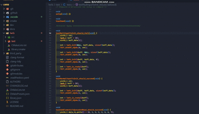

# DocuSnap — Code Annotation, Visual Preview · [中文](README.md)

DocuSnap lets you insert lightweight annotation tags in code comments like `@link@:relative/path.ext` and preview linked images or docs on hover. Organize assets in your project and keep code and documentation closely connected.

## Quick Look

## Features
- Editor context menu:
  - Insert image for code description
  - Insert document for code description
  - Insert image from clipboard (Windows only)
  - Smart Paste (optional Ctrl+V override): detect images or local file paths from clipboard with a 3-choice prompt: “Insert link / Rename & Insert / Normal paste”
  - If the current file extension is not configured in rules, insertion is blocked with a prompt guiding you to set `docuSnap.commentTokenRules`.
- Single tag format in comments: `<line-comment-prefix> @link@:relative/path.ext`
  - C/C++/C#/Java/JS/TS/Go/Rust: `// @link@:images/foo.png`
  - Python/Shell/PowerShell/YAML/TOML/R/Ruby/Perl: `# @link@:docs/bar.md`
  - SQL/Lua/Haskell: `-- @link@:images/foo.png`
  - MATLAB/Erlang: `% @link@:images/foo.png`
- Hover preview:
  - Images: loaded via URI by default (lower memory); tiny bitmaps may be inlined as base64; SVG always uses URI
  - Docs (md/txt): shows first 20 lines
  - Other types: link to open in editor
 - Sidebar views:
   - Links: list all `@link@` grouped by file; jump to code, filter missing-only, remove single link, clean current file
   - Preview: pin hover preview via the “📌 Pin Preview” action
 - Clean invalid links:
   - Fast workspace scan respecting Files: Exclude / Search: Exclude / .gitignore
   - Concurrent parsing, batched WorkspaceEdit deletions, with progress and status bar updates
   - Optionally delete orphan assets (files under assets not referenced by any `@link@`)
 - Diagnostics command: `DocuSnap: Diagnostics` prints workspace root, assetsDir, whitelisted extensions, merged excludes, and candidate samples (in verbose mode)

## Settings
- `docuSnap.assetsDir` (default: `.vscode/code-assets`)
  - Relative path: resolved from workspace root
  - Absolute path: used as-is
- `docuSnap.overridePaste` (default: false)
  - When enabled, overrides Ctrl+V with a confirm flow: if clipboard contains images or local file paths, ask to insert `@link@`; otherwise fall back to normal paste.
 - `docuSnap.commentTokenRules` (string array)
   - Rules-only config: use `{ext1,ext2}-{token}` to define line-comment token for multiple extensions. Examples: `{c,cpp,h,hpp,js,jsx,ts,tsx,mjs,cjs,java,cs,go,rs,kt,scala,swift}-{//}`, `{py,sh,bash,zsh,ps1,bat,toml,yaml,yml,r,pl,rb,coffee}-{#}`, `{lua,sql,hs}-{--}`, `{m,erl}-%`.
   - Extensions are case-insensitive; omit the leading dot (e.g., `py`). Tokens can be `//`, `#`, `--`, `%`, etc.
   - Deleting: use the command palette “DocuSnap: Delete mappings...” to remove selected extensions from rules; or edit `docuSnap.commentTokenRules` directly in Settings (JSON).
 - `docuSnap.verboseLog` (default: false)
   - Enable verbose logging: print candidate samples, per-file scanning, deletion details, etc. Off by default to keep logs quiet

## Usage
1. Right-click in the editor and choose “Insert image/document for code description”.
2. Pick one or more files. They’ll be copied into the configured assets directory (images go to `images/`, documents go to `docs/`).
3. The extension inserts a tag like `<prefix> @link@:images/name.png` at the cursor.
4. Hover the tag to preview.

### Smart Paste (optional Ctrl+V override)
1. Enable `docuSnap.overridePaste` in Settings
2. On paste, choose from: Insert link / Rename & Insert / Normal paste
3. “Rename & Insert” lets you rename files before copying into assets (auto-avoid name conflicts)

### Clean invalid links
1. Run “DocuSnap: Clean invalid links”
2. Choose the scope (current file / entire workspace)
3. Pick bad links and optionally orphan assets to delete, then confirm

## Donation
  If you find this extension helpful, please buy me a coffee☕️:

## License
MIT

---

How to update the demo GIF
- Record `images/demo.mp4` (use any screen capture tool)
- Convert MP4 to GIF via the included script:
  - In the VS Code terminal run:
  - npm run gif
  - This will regenerate `images/demo.gif`
