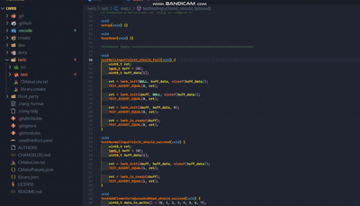

# 注释快贴（DocuSnap） · [English](README.en.md)

让你在代码中以 @link@ 标记插入与这段代码有关的图片/文档，并在悬浮时预览。

## 快速预览

## 功能
- 右键编辑器：
  - 插入代码描述图片
  - 插入代码描述文档
  - 从剪贴板插入代码描述图片（Windows / macOS / Linux）
  - 智能粘贴（可选覆盖 Ctrl+V）：检测剪贴板中的图片/本地文件路径，支持“插入链接 / 重命名插入 / 普通粘贴”三选一
    - 当当前文件扩展名未配置注释规则时，插入会阻断并提示你前往设置配置 `docuSnap.commentTokenRules`
- 标记格式（唯一）：`<注释前缀> @link@:relative/path.ext`
  - C/C++/C#/Java/JS/TS/Go/Rust 等：`// @link@:images/foo.png`
  - Python/Shell/PowerShell/YAML/TOML/R/Ruby/Perl 等：`# @link@:docs/bar.md`
  - SQL/Lua/Haskell：`-- @link@:images/foo.png`
  - MATLAB/Erlang：`% @link@:images/foo.png`
- 悬浮预览：
  - 图片：默认以 URI 加载（更省内存），对很小的位图才会内联 base64；SVG 始终使用 URI
  - 文档（md/txt）：展示前 20 行片段
  - 其他类型：提供“在编辑器中打开”链接
 - 侧边视图：
   - Links：按文件分组展示所有 `@link@`，支持跳转、只看无效链接、单个删除、清理当前文件
   - Preview：从悬浮窗“📌 固定预览”将资源固定到侧边预览

 - 清理无效链接：
   - 工作区快速扫描（遵守 Files: Exclude / Search: Exclude / .gitignore）
   - 并发解析、批量 WorkspaceEdit 删除、进度提示与状态栏进度
   - 可选清理孤立附件（assets 内未被引用的文件）
 - 诊断命令：`DocuSnap: Diagnostics` 输出工作区根、assetsDir、白名单扩展、合并后的排除规则、候选样本（详细模式）

## 配置
- `docuSnap.assetsDir`（默认：`.vscode/code-assets`）
  - 相对路径：相对工作区根目录
  - 绝对路径：直接使用该目录
- `docuSnap.overridePaste`（默认：false）
  - 开启后，用确认式粘贴覆盖编辑器中的 Ctrl+V：当剪贴板包含图片或本地文件路径时，先询问是否插入 `@link@`，否则回退为普通粘贴。
 - `docuSnap.commentTokenRules`（字符串数组）
   - 规则式配置（唯一来源）：使用 `{ext1,ext2}-{token}` 同时为多个扩展名定义注释前缀。例如：`{c,cpp,h,hpp,js,jsx,ts,tsx,mjs,cjs,java,cs,go,rs,kt,scala,swift}-{//}`、`{py,sh,bash,zsh,ps1,bat,toml,yaml,yml,r,pl,rb,coffee}-{#}`、`{lua,sql,hs}-{--}`、`{m,erl}-%`。
   - 扩展名大小写不敏感，建议不带点（如 `py`）；token 可写为 `//`、`#`、`--`、`%` 等。
   - 删除：使用命令面板“DocuSnap: 删除规则中的扩展名…（Delete mappings...）”，选择要移除的扩展名；或在 Settings(JSON) 直接编辑 `docuSnap.commentTokenRules`。
 - `docuSnap.verboseLog`（默认：false）
   - 打开“详细日志”模式：打印候选样本、逐文件扫描、删除明细等；默认关闭以保持安静

## 使用
1. 在代码中光标处右键，选择“插入代码描述图片/文档”
2. 选择一个或多个文件，插件会复制到配置的资产目录（图片放入 `images/`，文档放入 `docs/`）
3. 插件会在光标处插入形如 `<注释前缀> @link@:images/name.png` 的标记
4. 将鼠标悬停在该标记上可预览

### 智能粘贴（可选覆盖 Ctrl+V）
1. 在设置中启用 `docuSnap.overridePaste`
2. 粘贴时弹出三选一：插入链接 / 重命名插入 / 普通粘贴
3. 选择“重命名插入”可在复制入 assets 前为附件改名（自动避免重名冲突）

### 清理无效链接
### 平台依赖（从剪贴板插入图片）
- Windows：内置（使用 PowerShell API）
- macOS：需要安装 pngpaste（例如：brew install pngpaste）
- Linux：需要安装 wl-clipboard（wl-paste）或 xclip（Wayland 或 X11 环境）

1. 命令面板执行 “DocuSnap: 清理无效链接”
2. 选择范围（当前文件 / 整个工作区）
3. 勾选要删除的坏链接与（可选）孤立附件，确认后自动批量删除

## 捐赠
  如果你觉得这个扩展对你有帮助，请喝一杯咖啡☕️呗：

## 许可
MIT

---

附：如何更新预览 GIF
- 录制 `images/demo.mp4`（任意屏幕录制工具均可）
- 运行脚本将 MP4 转为 GIF：
  - 在 VS Code 终端执行（需要已安装 ffmpeg-static 依赖，仓库已包含脚本）：
  - npm run gif
  - 会在 `images/demo.gif` 覆盖生成新的演示动图
